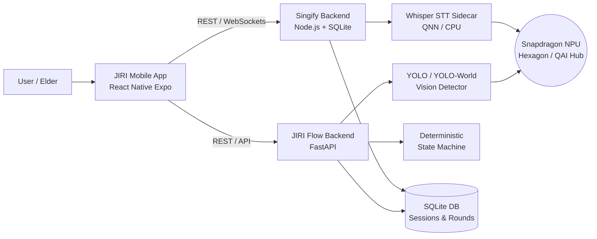

<div align="center">

# JIRI <sub>(ஜிரி)</sub>

**/ji-ri/** • *noun* • Tamil 

### On-Device Cognitive Task Guidance Assistant & Elder-Friendly Companion Platform

JIRI is a comprehensive ecosystem designed for dementia care and elder assistance. Running primarily on edge devices, it combines real-time vision and speech intelligence with interactive music and cognitive games to provide gentle, non-intrusive guidance through daily routines.

<sub>Built by **CyberPhantoms** for the SIH 2k26</sub>

</div>

> *"A gentle guide through the day, turning confusion into confidence."* — guiding principle of the team.

---

## Overview

JIRI is a privacy-first, AI-driven ecosystem designed specifically for dementia care. It seamlessly integrates continuous visual tracking and voice interaction to observe daily routines and deliver single, easy-to-follow cues. By relying on edge hardware (NPU), JIRI guarantees zero cloud dependency for sensitive data.

It operates seamlessly across **three modules**:
1. **JIRI Flow (AI Orchestrator)** — A localized deterministic task-state engine powered by Qualcomm AI Hub models. It observes daily routines through camera/microphone and provides single, gentle next-step cues.
2. **Singify (Interactive Hub)** — An elder-friendly karaoke and cognitive games platform featuring Assamese-language content, fuzzy-lyric recall, and NPU-accelerated Whisper voice processing.
3. **JIRI Mobile (Unified Wrapper)** — An Expo React Native application featuring a Caregiver Dashboard that unifies physical routine signals and cognitive milestones into a single timeline.

---

## Features

- **Edge AI Room Analysis** — Uses localized YOLO object detection (or YOLO-World via `qai_hub_models`) to continuously monitor objects and activities in the room without uploading frames to the cloud.
- **On-Device Voice Prompts** — NPU-accelerated speech-to-text (Whisper) processes patient responses instantly, adjusting cues based on verbal feedback.
- **Deterministic Cue Generator** — State-machine driven logic ensures the patient only ever receives *one* gentle instruction at a time to prevent cognitive overload.
- **Singify Companion App** — Built-in music therapy via karaoke and memory games (Fill-in-the-Blanks, Picture Match, Rhythm games) to stimulate cognitive functions.
- **Caregiver Dashboard** — Unified timeline merging physical routine progress with cognitive game accuracy/latency scores, providing a holistic view of the elder's wellbeing.
- **Fuzzy Lyric Recall** — Advanced Levenshtein-distance matching supports flexible voice and tap inputs during cognitive singing exercises.
- **Zero-Latency NPU Acceleration** — Transparent drop-in QNN Execution Provider integration for Whisper inference on Snapdragon Hexagon NPUs.

---

## Architecture



---

## Tech Stack

| Layer | Technologies |
|---|---|
| **Frontend (Mobile)** | Expo (React Native), `react-native-webview`, React Navigation |
| **Frontend (Singify)** | React, Vite, TypeScript, Tailwind CSS, Framer Motion |
| **Backend (Singify)** | Node.js, Express, TypeScript, SQLite (`better-sqlite3`) |
| **Backend (JIRI Flow)** | Python 3.12, FastAPI, Uvicorn, OpenCV |
| **AI / ML Ecosystem** | ONNX Runtime (`QNNExecutionProvider`), `qai-hub-models`, Whisper Tiny, YOLOv8 |

---

## Local Development & Setup

### 1. Run JIRI Flow (AI Task Guidance)

The core orchestrator runs locally using Python.

```bash
cd jiri-flow
python3 -m venv venv
source venv/bin/activate
pip install -r requirements.txt

# Launch Dashboard + Vision Tracker + AI Cue Generator
python run_demo.py
```
*(Runs locally on `http://localhost:8000`)*

### 2. Run Singify (Music & Cognitive Games)

Start both the React frontend and Node.js backend concurrently.

```bash
cd singify
npm run install:all
npm run dev
```
*(Frontend runs on `http://localhost:5173`, Backend on `http://localhost:4000`)*

### 3. Run JIRI Mobile (Unified App)

Wrap it all into a single native mobile interface. Ensure the backends are running first.

```bash
cd mobile
npm install
npm run start
```
*(Use the Expo Go app or press `i`/`a` to launch in the simulator)*

---

## Repository Structure

```
.
├── jiri-flow/              # Python orchestrator, Vision/Speech pipelines, FastAPI dashboard
│   ├── app/                # Core AI tasks, deterministic state machine, APIs
│   ├── routines/           # JSON templates for daily tasks (e.g., Medicine, Tea)
│   └── tests/              # E2E simulations and latency benchmarks
├── singify/                # React + Node.js karaoke and memory games hub
│   ├── frontend/           # Vite React App (Karaoke UI, cognitive games)
│   ├── backend/            # Express Server, SQLite, NPU Whisper sidecar
│   └── data/               # SQLite db and song JSON catalogs
├── mobile/                 # Expo React Native wrapper unifying the UI
│   ├── src/screens/        # Native screens for Dashboards & Games
│   └── assets/             # Brand identity and icons
├── lib/                    # Legacy/Alternative Flutter implementation
└── README.md               # You are here
```

---

## Team — CyberPhantoms

- **Ranen Joseph Solomon**
- **Jaiyantan**
- **Thirumurugan**
- **Kabelan**

---

## License

Released under the [MIT License](mobile/LICENSE) © 2026 CyberPhantoms.
